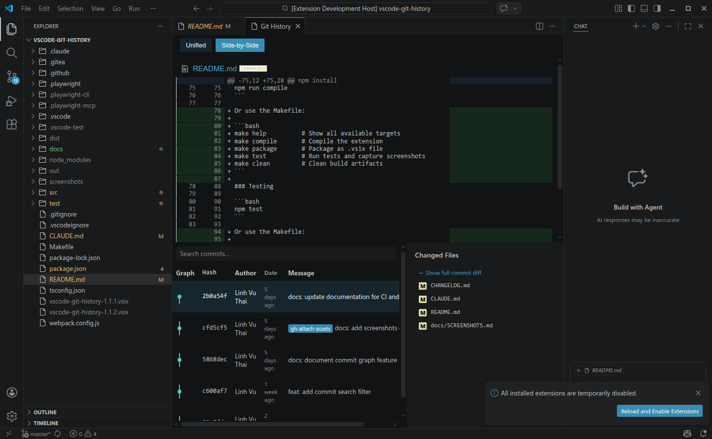
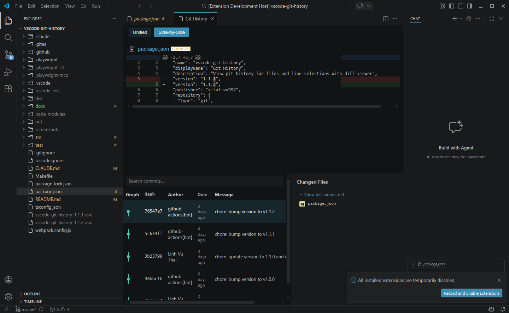

# Git History for VS Code

A powerful VS Code extension that provides git history visualization inspired by IntelliJ's Git History. View file history, selection history, and explore diffs with an intuitive interface.

### File History

### Selection History

## Features

- **File History**: Right-click anywhere in an editor to view the complete git history of that file
- **Selection History**: Select lines of code and view only commits that affected those specific lines
- **Commit Graph**: Visual branch and merge graph (like `git log --graph`) rendered as inline SVG in the history table
- **Commit Statistics**: See the number of files changed, insertions, and deletions for each commit directly in the commit list with color-coded indicators (green for additions, red for deletions)
- **Search Commits**: Filter commits in real time by message, author, email, hash, or tag name with count indicator. Supports date filters: `after:YYYY-MM-DD`, `before:YYYY-MM-DD`, `last:Ndays/weeks/months`. Supports author filter: `author:name` or click any author name to filter
- **Sort Toggle**: Switch between newest-first and oldest-first commit ordering with the sort button in the toolbar
- **Multi-Select**: Select multiple commits to see a combined diff showing all changes
- **Diff Viewer**: Toggle between unified and side-by-side diff views
- **Changed Files**: See all files modified in a commit with status indicators (Added/Modified/Deleted/Renamed)
- **Git Tags**: Tag badges displayed in commit list for annotated and lightweight tags
- **Blame Annotations**: Toggle inline blame annotations showing commit author and date per line, with a status bar showing commit details for the current line
- **Date Display**: Commit dates show relative time (e.g., "Today 2:30 PM", "Yesterday 3:45 PM") with time for recent commits; hover to see absolute timestamps
- **Expandable Commit Messages**: Click the arrow button on commits with multi-line messages to view the full commit body
- **Hide Merge Commits**: Toggle the "No Merge" button to filter out merge commits and focus on actual work commits; the count indicator shows how many commits are hidden
- **Jump to Hash**: Press `Ctrl+G` / `Cmd+G` to open a dialog and quickly navigate to a specific commit by hash
- **Refresh**: Reload commit history with the refresh button or `Ctrl+Shift+R` / `Cmd+Shift+R` keyboard shortcut
- **Copy Commit Message**: Copy the commit message, author, email, and date to clipboard with the copy button or `Ctrl+Shift+C` / `Cmd+Shift+C` keyboard shortcut
- **Copy Commit Hash**: Copy the full commit hash to clipboard with `Ctrl+Shift+H` / `Cmd+Shift+H` keyboard shortcut, or click any hash chip
- **Copy Commit Info**: Copy the full commit information (hash, author, date, message) to clipboard with `Ctrl+Shift+I` / `Cmd+Shift+I` keyboard shortcut
- **Copy Cherry-Pick Command**: Copy a pre-formatted `git cherry-pick <hash>` command to the clipboard with `Ctrl+Shift+P` / `Cmd+Shift+P` keyboard shortcut, or right-click on any commit
- **Copy Changed Files**: Copy the list of changed files for a commit to clipboard with `Ctrl+Shift+F` / `Cmd+Shift+F` keyboard shortcut, or right-click on any commit
- **Copy Commit Diff**: Copy the full diff output for a commit to clipboard with `Ctrl+Shift+D` / `Cmd+Shift+D` keyboard shortcut, or right-click on any commit
- **Copy File Path**: Right-click on any file in the changed files list to copy its full path to clipboard
- **Open File at Commit**: Right-click on any file in the changed files list to view the file content as it was at that specific commit
- **Branch Indicator**: Current branch name is displayed as a badge in the commit details panel for quick context
- **Dark/Light Theme**: Automatically adapts to your VS Code theme using native CSS variables

## Installation

1. Press `F1` (or `Ctrl+Shift+P` / `Cmd+Shift+P`) to open the Command Palette
2. Type "Extensions: Install Extensions"
3. Search for "Git History"
4. Click Install

## Usage

### View File History

1. Open any file in a git repository
2. Right-click in the editor
3. Select "Git History (File)"
4. The history panel will open showing all commits

### View Selection History

1. Select one or more lines of code
2. Right-click in the editor
3. Select "Git History for Selection"
4. The history panel will show only commits that affected your selection

### Using the History Panel

- **Click a commit row** to view its diff and changed files
- **Check multiple commits** to see a combined diff
- **Search commits** using the search box to filter by message, author, email, hash, or tag name. You can also use date filters:
  - `after:2024-01-01` - show commits after a specific date
  - `before:2024-06-01` - show commits before a specific date
  - `last:7days` or `last:2weeks` or `last:1month` - show commits within a recent time period
  - Combine filters: `bug fix after:2024-01-01` - search for "bug fix" in commits after January 1st
- **Filter by author** using `author:` prefix or click any author name in the commit list:
  - `author:Alice` - show commits by author name (case-insensitive)
  - `author:alice@example.com` - show commits by email
  - Combine with other filters: `author:Bob fix after:2024-01-01`
- **Toggle sort order** with the sort button to switch between newest-first and oldest-first
- **Hide merge commits** with the "No Merge" button to focus on actual work commits; the count indicator shows "X of Y" when filters are active
- **Toggle view mode** between Unified and Side-by-Side
- **Scroll the diff viewer** to see all changes

#### Context Menu Actions

Right-click on commits in the commit list or files in the changed files list to access additional options:

**Commit Row Context Menu:**

| Action | Description |
|--------|-------------|
| **Copy commit hash** | Copy the full commit hash to clipboard |
| **Copy commit message** | Copy the commit message to clipboard |
| **Copy commit info** | Copy full commit information (hash, author, date, message) |
| **Copy cherry-pick command** | Copy a pre-formatted `git cherry-pick <hash>` command |
| **Copy changed files** | Copy the list of changed files to clipboard |
| **Copy commit diff** | Copy the full diff output to clipboard |

**Changed Files Context Menu:**

| Action | Description |
|--------|-------------|
| **Open file at this commit** | View the file content as it was at the selected commit |
| **View diff for this file** | Show the diff for this specific file only |
| **Copy file path** | Copy the full file path to clipboard |

#### Keyboard Navigation

Navigate the commit list using keyboard shortcuts:

| Key | Action |
|-----|--------|
| `↑` / `↓` | Navigate up/down through commits |
| `Home` | Jump to first commit |
| `End` | Jump to last commit |
| `Enter` | Select focused commit and show its diff |
| `Ctrl+Enter` / `Cmd+Enter` | Add/remove focused commit from multi-selection |
| `/` or `Ctrl+F` / `Cmd+F` | Focus the search input |
| `Ctrl+Shift+C` / `Cmd+Shift+C` | Copy commit message to clipboard |
| `Ctrl+Shift+H` / `Cmd+Shift+H` | Copy commit hash to clipboard |
| `Ctrl+Shift+I` / `Cmd+Shift+I` | Copy full commit info to clipboard |
| `Ctrl+Shift+P` / `Cmd+Shift+P` | Copy cherry-pick command to clipboard |
| `Ctrl+Shift+F` / `Cmd+Shift+F` | Copy changed files to clipboard |
| `Ctrl+Shift+D` / `Cmd+Shift+D` | Copy commit diff to clipboard |
| `Ctrl+G` / `Cmd+G` | Jump to commit by hash |
| `Escape` | Clear selection and search focus |

### Using Blame Annotations

1. Open any file in a git repository
2. Press `Ctrl+Shift+B` / `Cmd+Shift+B` or right-click and select "Toggle Blame Annotations"
3. Inline decorations appear showing the author and date for each line's last commit
4. The status bar shows commit details for the current line
5. Click the status bar or use "Git: Show Blame Commit" to view the full commit diff

## Requirements

- Visual Studio Code 1.85.0 or higher
- Git installed and available in your PATH
- A git repository

## Extension Settings

This extension contributes the following settings:

* `gitHistory.maxCommits`: Maximum number of commits to display (default: 500)
* `gitHistory.showGraph`: Show commit graph visualization in the history view (default: true)
* `gitHistory.hideMergeCommits`: Hide merge commits in the history view (default: false)
* `gitHistory.blame.dateFormat`: Date format for blame annotations - `relative` (e.g., "2 days ago"), `short` (e.g., "2024-03-15"), or `iso` (e.g., "2024-03-15T10:30:00Z") (default: `relative`)

## Keyboard Shortcuts

### Global Commands

| Command | Keybinding |
|---------|------------|
| Git History (File) | (none - customize as desired) |
| Git History for Selection | (none - customize as desired) |
| Toggle Blame Annotations | `Ctrl+Shift+B` / `Cmd+Shift+B` |
| Refresh History | `Ctrl+Shift+R` / `Cmd+Shift+R` |

### History Panel Navigation

| Command | Keybinding |
|---------|------------|
| Navigate commits (up/down) | `↑` / `↓` |
| First commit | `Home` |
| Last commit | `End` |
| Select commit | `Enter` |
| Multi-select toggle | `Ctrl+Enter` / `Cmd+Enter` |
| Focus search | `/` or `Ctrl+F` / `Cmd+F` |
| Copy commit message | `Ctrl+Shift+C` / `Cmd+Shift+C` |
| Copy commit hash | `Ctrl+Shift+H` / `Cmd+Shift+H` |
| Clear selection | `Escape` |

## License

MIT

## Issues

Report issues at: https://github.com/vitalivu992/vscode-git-history/issues

