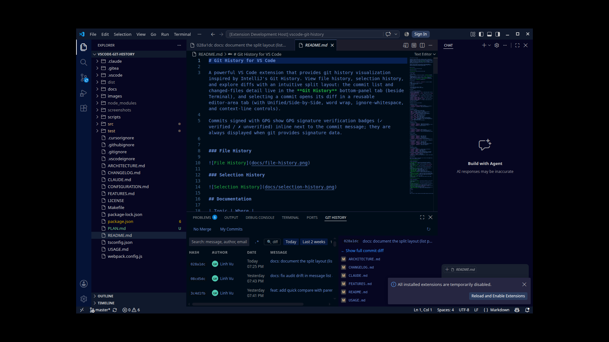
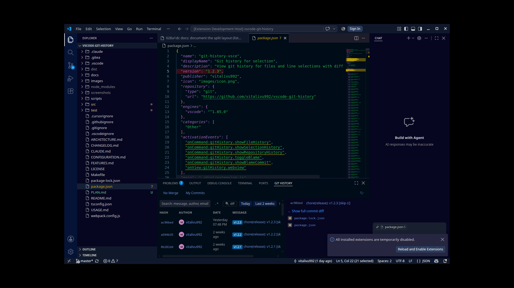

# Git History for VS Code

A powerful VS Code extension that provides git history visualization inspired by IntelliJ's Git History. View file history, selection history, and explore diffs with an intuitive interface.

### File History

### Selection History

## Features

- **File History**: Right-click anywhere in an editor to view the complete git history of that file
- **Selection History**: Select lines of code and view only commits that affected those specific lines
- **Commit Graph**: Visual branch and merge graph (like `git log --graph`) rendered as inline SVG in the history table
- **Commit Statistics**: See the number of files changed, insertions, and deletions for each commit directly in the commit list with color-coded indicators (green for additions, red for deletions)
- **Search Commits**: Filter commits in real time by message, author, email, hash, or tag name with count indicator. Supports date filters: `after:YYYY-MM-DD`, `before:YYYY-MM-DD`, `last:Ndays/weeks/months`. Supports author filter: `author:name` or click any author name to filter. Supports tag filter: `tag:name` or click any tag badge to filter by tag. Supports regex mode with the .* button for advanced pattern matching like `bug(fix|patch)|hotfix` or `^feat:.*`.
- **Sort Toggle**: Switch between newest-first and oldest-first commit ordering with the sort button in the toolbar
- **Compare Any Two Commits**: Shift+click (or Shift+Enter) two commits to see the diff between them
- **Multi-Select**: Select multiple commits to see a combined diff showing all changes
- **Diff Viewer**: Toggle between unified and side-by-side diff views with optional word wrap for long lines. Set your preferred default view via `gitHistory.defaultDiffView` setting
- **Word Wrap Toggle**: Enable word wrap in the diff viewer to handle long lines in JSON, minified code, and other content
- **Ignore Whitespace Toggle**: Toggle ignore whitespace in diffs to focus on actual code changes rather than formatting/indentation differences. Uses git's `-w` flag to render cleaner diffs when only whitespace has changed.
- **Changed Files**: See all files modified in a commit with status indicators (Added/Modified/Deleted/Renamed)
- **Git Tags**: Tag badges displayed in commit list for annotated and lightweight tags
- **Blame Annotations**: Toggle inline blame annotations showing commit author and date per line, with a status bar showing commit details for the current line. Click on any blame decoration to view the full commit in the history panel. (Note: Requires an active text editor)
- **Date Display**: Commit dates show relative time (e.g., "Today 2:30 PM", "Yesterday 3:45 PM") with time for recent commits; hover to see absolute timestamps
- **Expandable Commit Messages**: Click the arrow button on commits with multi-line messages to view the full commit body
- **Hide Merge Commits**: Toggle the "No Merge" button to filter out merge commits and focus on actual work commits; the count indicator shows how many commits are hidden
- **Show My Commits Only**: Toggle the "My Commits" button to quickly filter and show only commits authored by the current git user (based on git config user.name and user.email); disabled when git user is not configured
- **Jump to Hash**: Press `Ctrl+G` / `Cmd+G` to open a dialog and quickly navigate to a specific commit by hash
- **Refresh**: Reload commit history with the refresh button or `Ctrl+Shift+R` / `Cmd+Shift+R` keyboard shortcut
- **Copy Commit Message**: Copy the commit message, author, email, and date to clipboard with the copy button or `Ctrl+Shift+C` / `Cmd+Shift+C` keyboard shortcut
- **Copy Commit Hash**: Copy the full commit hash to clipboard with `Ctrl+Shift+H` / `Cmd+Shift+H` keyboard shortcut, or click any hash chip
- **Copy Author Email**: Copy the author email address to clipboard with `Ctrl+Shift+A` / `Cmd+Shift+A` keyboard shortcut, or right-click context menu
- **Copy Author Name**: Copy the author name to clipboard with `Ctrl+Shift+N` / `Cmd+Shift+N` keyboard shortcut, or right-click context menu
- **Copy Parent Hash**: Copy the first parent hash to clipboard with `Ctrl+Shift+V` / `Cmd+Shift+V` keyboard shortcut, or right-click context menu. For root commits (no parent), an error message is shown.
- **Copy Short Hash**: Copy the 7-character short hash to clipboard with `Ctrl+Shift+7` / `Cmd+Shift+7` keyboard shortcut, or right-click context menu
- **📌 Copy Subject**: Copy only the commit subject (first line of the commit message) to clipboard with `Ctrl+Shift+6` / `Cmd+Shift+6` keyboard shortcut, or right-click context menu
- **📊 Copy Diff Stat Summary**: Copy just the diff stat summary (e.g., "3 files changed, 45 insertions(+), 12 deletions(-)") to clipboard with `Ctrl+Shift+9` / `Cmd+Shift+9` keyboard shortcut, or right-click context menu. Uses singular forms when counts are 1 (e.g., "1 file changed, 1 insertion(+), 1 deletion(-)").
- **≡ Copy as Oneline**: Copy the commit in `git log --oneline` format (`{shortHash} {subject}`) to clipboard with `Ctrl+Shift+Y` / `Cmd+Shift+Y` keyboard shortcut, or right-click context menu. Example: `a1b2c3d Fix authentication bug`
- **📄 Copy Commit Body**: Copy just the commit body (the multi-line description after the subject line) to clipboard with `Ctrl+Shift+Z` / `Cmd+Shift+Z` keyboard shortcut, or right-click context menu. Shows "Commit has no body" for single-line commits.
- **👥 Copy Co-Authors**: Copy co-authors from commit message to clipboard with `Ctrl+Shift+K` / `Cmd+Shift+K` keyboard shortcut, or right-click context menu. Extracts "Co-authored-by:" trailers in the format "Name <email>" separated by newlines.
- **🕐 Copy Commit Date**: Copy the commit date in ISO 8601 format to clipboard with `Ctrl+Shift+T` / `Cmd+Shift+T` keyboard shortcut, or right-click context menu
- **Copy Selected Hashes**: Copy all selected commit hashes as a newline-separated list with `Ctrl+Shift+;` / `Cmd+Shift+;` keyboard shortcut (when 2+ commits are selected), or right-click context menu (shown when multiple commits are selected). Falls back to single hash copy when 0 or 1 commit is selected.
- **Copy Commit Info**: Copy the full commit information (hash, author, date, message) to clipboard with `Ctrl+Shift+I` / `Cmd+Shift+I` keyboard shortcut
- **Copy Cherry-Pick Command**: Copy a pre-formatted `git cherry-pick <hash>` command to the clipboard with `Ctrl+Shift+P` / `Cmd+Shift+P` keyboard shortcut, or right-click on any commit
- **Copy Revert Command**: Copy a pre-formatted `git revert <hash>` command to the clipboard with `Ctrl+Shift+U` / `Cmd+Shift+U` keyboard shortcut, or right-click on any commit
- **Copy Commit as Patch**: Copy the commit as a unified diff patch (with git headers) suitable for `git apply` or `git am` with `Ctrl+Shift+E` / `Cmd+Shift+E` keyboard shortcut, or right-click on any commit
- **Copy Commit URL**: Copy the web URL for a commit to share with others. Automatically detects GitHub, GitLab, and Bitbucket remotes (including self-hosted instances). Use `Ctrl+Shift+L` / `Cmd+Shift+L` or right-click on any commit
- **Copy Commit Stats**: Copy commit statistics (files changed, insertions, deletions) to clipboard with `Ctrl+Shift+S` / `Cmd+Shift+S` keyboard shortcut, or right-click on any commit
- **Quick Compare with Parent**: Instantly compare the selected commit with its parent to see what changed in that specific commit. Use the "Compare" button or press `Ctrl+Alt+P` / `Cmd+Alt+P`. For root commits (first commit), an error is shown since there's no parent.
- **Create Branch from Commit**: Right-click on any commit to create a new branch at that point in history. You'll be prompted for a branch name, and the branch will be created at the selected commit using `git branch <name> <hash>`.
- **Create Tag from Commit**: Right-click on any commit to create a new git tag at that point in history. Supports both lightweight tags (enter tag name only) and annotated tags (enter a message when prompted). The tag will be created using `git tag <name> <hash>` or `git tag -a <name> -m <message> <hash>`.
- **Branch Switching**: Right-click on the branch badge or press `Ctrl+Alt+B` / `Cmd+Alt+B` to switch between branches. A searchable picker dialog shows all local and remote branches. The panel automatically refreshes after successful checkout.
- **Copy Changed Files**: Copy the list of changed files for a commit to clipboard with `Ctrl+Shift+F` / `Cmd+Shift+F` keyboard shortcut, or right-click on any commit
- **Copy Commit Diff**: Copy the full diff output for a commit to clipboard with `Ctrl+Shift+D` / `Cmd+Shift+D` keyboard shortcut, or right-click on any commit
- **Copy File Path**: Right-click on any file in the changed files list to copy its full path to clipboard
- **Open File at Commit**: Right-click on any file in the changed files list to view the file content as it was at that specific commit
- **Export Filtered Commits**: Click the "Export" button or press `Ctrl+Shift+O` / `Cmd+Shift+O` to export the currently filtered commit list to JSON, CSV, or Markdown format. The Markdown format generates a changelog-style output with commit hashes, authors, dates, messages, tags, and statistics—perfect for release notes and documentation.
- **Select All Commits**: Press `Ctrl+A` / `Cmd+A` to quickly select all visible commits for bulk operations like export or copy
- **Branch Indicator**: Current branch name is displayed as a badge in the commit details panel for quick context
- **First-Run Welcome Tip**: On first use, a helpful tip appears directing you to keyboard shortcuts (press `?` for help), ensuring you discover the extension's full capabilities
- **Keyboard Help**: Press `?` in the history panel to show a quick reference of all available keyboard shortcuts
- **Dark/Light Theme**: Automatically adapts to your VS Code theme using native CSS variables

## Installation

1. Press `F1` (or `Ctrl+Shift+P` / `Cmd+Shift+P`) to open the Command Palette
2. Type "Extensions: Install Extensions"
3. Search for "Git History"
4. Click Install

## Usage

### View File History

1. Open any file in a git repository
2. Right-click in the editor
3. Select "Git History (File)"
4. The history panel will open showing all commits

### View Selection History

1. Select one or more lines of code
2. Right-click in the editor
3. Select "Git History for Selection"
4. The history panel will show only commits that affected your selection

### Using the History Panel

- **Click a commit row** to view its diff and changed files
- **Shift+click two commits** to compare any two commits and see what changed between them (e.g., compare v1.0 to v2.0)
- **Ctrl+click** to multi-select non-consecutive commits for a combined diff
- **Search commits** using the search box to filter by message, author, email, hash, or tag name. You can also use date filters:
  - `after:2024-01-01` - show commits after a specific date
  - `before:2024-06-01` - show commits before a specific date
  - `last:7days` or `last:2weeks` or `last:1month` - show commits within a recent time period
  - Combine filters: `bug fix after:2024-01-01` - search for "bug fix" in commits after January 1st
- **Filter by author** using `author:` prefix or click any author name in the commit list:
  - `author:Alice` - show commits by author name (case-insensitive)
  - `author:alice@example.com` - show commits by email
  - Combine with other filters: `author:Bob fix after:2024-01-01`
- **Filter by tag** using `tag:` prefix or click any tag badge in the commit list:
  - `tag:v1.0.0` - show commits with a tag matching "v1.0.0" (case-insensitive, partial match)
  - `tag:release` - show commits with tags containing "release"
  - Combine with other filters: `tag:v2.0 author:Bob after:2024-01-01`
- **Filter by branch** using `branch:` prefix:
  - `branch:main` - show commits on main branch
  - `branch:feature/login` - show commits on feature branch (case-insensitive, partial match)
  - Combine with other filters: `branch:main author:Bob after:2024-01-01`
- **Filter by path** using `path:` prefix:
  - `path:src/main.ts` - show commits that modified this specific file
  - `path:src/` - show commits that modified any file in src/ directory
  - Combine with other filters: `path:src/ author:Bob after:2024-01-01`
- **Regex search mode**: Click the .* button (or press `Ctrl+Shift+X` / `Cmd+Shift+X`) to enable regex pattern matching:
  - `^feat:` - match commits starting with "feat:"
  - `bug(fix|patch)|hotfix` - match "bugfix", "bugpatch", or "hotfix"
  - `\\bfix\\b` - match whole word "fix" (not "bugfix")
  - Invalid regex patterns show red border on the button; filtering falls back to substring matching
- **Toggle sort order** with the sort button to switch between newest-first and oldest-first
- **Hide merge commits** with the "No Merge" button to focus on actual work commits; the count indicator shows "X of Y" when filters are active
- **Show my commits only** with the "My Commits" button to quickly filter commits authored by you (based on `git config user.name` and `user.email`). The button is disabled if git user is not configured.
- **Toggle view mode** between Unified and Side-by-Side
- **Scroll the diff viewer** to see all changes

### First-Run Tip

When you first open Git History, you'll see a welcome banner with a tip about keyboard shortcuts. Press `?` in the history panel at any time to see all available keyboard shortcuts. Click "Got it" to dismiss the tip - it will only appear once.

The tip is automatically saved using VS Code's global state, so you won't see it again after dismissing it. This ensures new users discover the powerful keyboard shortcuts available in the extension while not getting in the way of experienced users.

#### Context Menu Actions

Right-click on commits in the commit list or files in the changed files list to access additional options:

**Commit Row Context Menu:**

| Action | Description |
|--------|-------------|
| **Copy commit hash** | Copy the full commit hash to clipboard |
| **Copy commit message** | Copy the commit message to clipboard |
| **Copy commit info** | Copy full commit information (hash, author, date, message) |
| **Copy cherry-pick command** | Copy a pre-formatted `git cherry-pick <hash>` command |
| **Copy changed files** | Copy the list of changed files to clipboard |
| **Copy commit diff** | Copy the full diff output to clipboard |
| **Copy as patch** | Copy the commit as a unified diff patch (for `git apply` or `git am`) |
| **Copy commit URL** | Copy the web URL (GitHub/GitLab/Bitbucket) for the commit |
| **Copy stats** | Copy commit statistics (files changed, insertions, deletions) to clipboard |
| **Copy co-authors** | Copy co-authors from commit message ("Co-authored-by:" trailers) |
| **Create branch from commit** | Create a new branch at the selected commit. You'll be prompted for a branch name. |

**Changed Files Context Menu:**

| Action | Description |
|--------|-------------|
| **Open file at this commit** | View the file content as it was at the selected commit |
| **View diff for this file** | Show the diff for this specific file only |
| **Copy file content** | Copy the full content of a file at the selected commit to clipboard. Useful for sharing code snippets from historical versions. |
| **Copy file path** | Copy the full file path to clipboard |
| **Copy file name only** | Copy just the filename (e.g., `main.js`) to clipboard |

#### Keyboard Navigation

Navigate the commit list using keyboard shortcuts:

| Key | Action |
|-----|--------|
| `↑` / `↓` | Navigate up/down through commits |
| `Home` | Jump to first commit |
| `End` | Jump to last commit |
| `Enter` | Select focused commit and show its diff |
| `Shift+Enter` | Select range from anchor to focused commit |
| `Ctrl+Enter` / `Cmd+Enter` | Add/remove focused commit from multi-selection |
| `Ctrl+A` / `Cmd+A` | Select all visible commits |
| `/` or `Ctrl+F` / `Cmd+F` | Focus the search input |
| `Ctrl+Shift+C` / `Cmd+Shift+C` | Copy commit message to clipboard |
| `Ctrl+Shift+H` / `Cmd+Shift+H` | Copy commit hash to clipboard |
| `Ctrl+Shift+I` / `Cmd+Shift+I` | Copy full commit info to clipboard |
| `Ctrl+Shift+J` / `Cmd+Shift+J` | Toggle ignore whitespace in diffs |
| `Ctrl+Shift+P` / `Cmd+Shift+P` | Copy cherry-pick command to clipboard |
| `Ctrl+Shift+U` / `Cmd+Shift+U` | Copy revert command to clipboard |
| `Ctrl+Shift+W` / `Cmd+Shift+W` | Toggle word wrap in diff viewer |
| `Ctrl+Shift+E` / `Cmd+Shift+E` | Copy commit as patch to clipboard |
| `Ctrl+Shift+L` / `Cmd+Shift+L` | Copy commit URL to clipboard |
| `Ctrl+Shift+M` / `Cmd+Shift+M` | Toggle "Show my commits only" filter |
| `Ctrl+Shift+S` / `Cmd+Shift+S` | Copy commit stats to clipboard |
| `Ctrl+Shift+B` / `Cmd+Shift+B` | Copy branch name to clipboard |
| `Ctrl+Shift+G` / `Cmd+Shift+G` | Copy tags to clipboard |
| `Ctrl+Shift+A` / `Cmd+Shift+A` | Copy author email to clipboard |
| `Ctrl+Shift+N` / `Cmd+Shift+N` | Copy author name to clipboard |
| `Ctrl+Shift+V` / `Cmd+Shift+V` | Copy parent hash to clipboard |
| `Ctrl+Shift+7` / `Cmd+Shift+7` | Copy short hash (7 characters) to clipboard |
| `Ctrl+Shift+6` / `Cmd+Shift+6` | Copy subject (commit title) to clipboard |
| `Ctrl+Shift+9` / `Cmd+Shift+9` | Copy diff stat summary to clipboard |
| `Ctrl+Shift+Y` / `Cmd+Shift+Y` | Copy as oneline (`shortHash subject`) to clipboard |
| `Ctrl+Shift+K` / `Cmd+Shift+K` | Copy co-authors to clipboard |
| `Ctrl+Shift+T` / `Cmd+Shift+T` | Copy commit date (ISO 8601 format) to clipboard |
| `Ctrl+Shift+8` / `Cmd+Shift+8` | Copy relative date (e.g., "Today 2:30 PM", "3 days ago") to clipboard |
| `Ctrl+Shift+;` / `Cmd+Shift+;` | Copy selected hashes to clipboard (2+ commits) |
| `Ctrl+Shift+,` / `Cmd+Shift+,` | Copy file name only to clipboard |
| `Ctrl+Shift+.` / `Cmd+Shift+.` | Copy file path to clipboard (for focused file in changed files list) |
| `Ctrl+Shift+O` / `Cmd+Shift+O` | Export filtered commits to file |
| `Ctrl+Shift+5` / `Cmd+Shift+5` | Copy filter query state to clipboard (includes search query and all toggle states as JSON) |
| `Ctrl+Alt+P` / `Cmd+Alt+P` | Quick compare with parent |
| `Ctrl+Alt+B` / `Cmd+Alt+B` | Show branch switcher |
| `Ctrl+Shift+F` / `Cmd+Shift+F` | Copy changed files to clipboard |
| `Ctrl+Shift+D` / `Cmd+Shift+D` | Copy commit diff to clipboard |
| `Ctrl+Shift+X` / `Cmd+Shift+X` | Toggle regex search mode |
| `Ctrl+Shift+Q` / `Cmd+Shift+Q` | Toggle hide merge commits |
| `Ctrl+Shift+/` / `Cmd+Shift+/` | Cycle diff context lines (1-10) |
| `Ctrl+G` / `Cmd+G` | Jump to commit by hash |
| `?` | Show keyboard shortcuts help |
| `Escape` | Clear selection and search focus |

### Using Blame Annotations

1. Open any file in a git repository
2. Press `Ctrl+Shift+B` / `Cmd+Shift+B` or right-click and select "Toggle Blame Annotations"
3. Inline decorations appear showing the author and date for each line's last commit
4. The status bar shows commit details for the current line
5. Click the status bar or use "Git: Show Blame Commit" to view the full commit diff

**Note**: The "Show Blame Commit" command requires an active text editor. If triggered without an active editor, a warning message "No active editor found" will be displayed.

## Requirements

- Visual Studio Code 1.85.0 or higher
- Git installed and available in your PATH
- A git repository

## Extension Settings

This extension contributes the following settings:

* `gitHistory.maxCommits`: Maximum number of commits to display (default: 500)
* `gitHistory.showGraph`: Show commit graph visualization in the history view (default: true)
* `gitHistory.hideMergeCommits`: Hide merge commits in the history view (default: false)
* `gitHistory.blame.dateFormat`: Date format for blame annotations - `relative` (e.g., "2 days ago"), `short` (e.g., "2024-03-15"), or `iso` (e.g., "2024-03-15T10:30:00Z") (default: `relative`)
* `gitHistory.defaultDiffView`: Default diff view mode when opening Git History - `unified` or `side-by-side` (default: `unified`). **Note**: User settings from the previous session take precedence over this configuration.
* `gitHistory.diffContextLines`: Number of context lines to show in diffs (default: `3`, range: `1-10`). Increase for more context during code review, decrease for more focused diffs.

### Persistent User Preferences

Git History automatically saves and restores your view preferences across VS Code sessions. The following settings are remembered:

- **Diff Type**: Your choice of unified or side-by-side diff view
- **Word Wrap**: Whether word wrap is enabled in the diff viewer
- **Sort Order**: Newest-first or oldest-first commit ordering
- **Hide Merge Commits**: Whether merge commits are filtered out
- **Show My Commits Only**: Whether to show only commits by the current git user
- **Regex Search Mode**: Whether regex search is enabled
- **Ignore Whitespace**: Whether to ignore whitespace in diffs

These preferences are saved automatically when you change them in the UI, and restored the next time you open Git History. This allows you to maintain your preferred workflow without reconfiguring each time.

## Keyboard Shortcuts

### Global Commands

| Command | Keybinding |
|---------|------------|
| Git History (File) | (none - customize as desired) |
| Git History for Selection | (none - customize as desired) |
| Toggle Blame Annotations | `Ctrl+Shift+B` / `Cmd+Shift+B` |
| Refresh History | `Ctrl+Shift+R` / `Cmd+Shift+R` |

### History Panel Navigation

| Command | Keybinding |
|---------|------------|
| Navigate commits (up/down) | `↑` / `↓` |
| First commit | `Home` |
| Last commit | `End` |
| Select commit | `Enter` |
| Multi-select toggle | `Ctrl+Enter` / `Cmd+Enter` |
| Focus search | `/` or `Ctrl+F` / `Cmd+F` |
| Copy commit message | `Ctrl+Shift+C` / `Cmd+Shift+C` |
| Toggle word wrap | `Ctrl+Shift+W` / `Cmd+Shift+W` |
| Toggle ignore whitespace | `Ctrl+Shift+J` / `Cmd+Shift+J` |
| Toggle my commits filter | `Ctrl+Shift+M` / `Cmd+Shift+M` |
| Toggle regex search mode | `Ctrl+Shift+X` / `Cmd+Shift+X` |
| Copy commit hash | `Ctrl+Shift+H` / `Cmd+Shift+H` |
| Copy commit subject | `Ctrl+Shift+6` / `Cmd+Shift+6` |
| Copy diff stat summary | `Ctrl+Shift+9` / `Cmd+Shift+9` |
| Copy as oneline | `Ctrl+Shift+Y` / `Cmd+Shift+Y` |
| Copy commit date | `Ctrl+Shift+T` / `Cmd+Shift+T` |
| Copy relative date | `Ctrl+Shift+8` / `Cmd+Shift+8` |
| Copy short hash | `Ctrl+Shift+7` / `Cmd+Shift+7` |
| Copy selected hashes | `Ctrl+Shift+;` / `Cmd+Shift+;` (when 2+ selected) |
| Clear selection | `Escape` |

## License

MIT

## Issues

Report issues at: https://github.com/vitalivu992/vscode-git-history/issues

